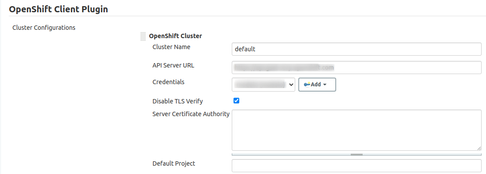

# jenkins Local

## Criando o Volume

```
podman volume create jenkins_home
```

## Iniciando o Container

```
podman run --name jenkins --rm -p 8080:8080 -p 50000:50000 \
         -v jenkins_home:/var/jenkins_home \
         jenkins:jcasc
```

## Configurações

### Credenciais

Usar a saída do comando `oc whoami -t` para configurar a credencial do cluster

Criar uma nova credencial de usuário para o git com o mesmo nome usado no pipeline

### OpenShift

É importante que o nome seja 'default' para não ter que alterar o pipeline



### Slaves

Criar um nó do tipo "mock" e atribuir o mesmo nome do pipeline
